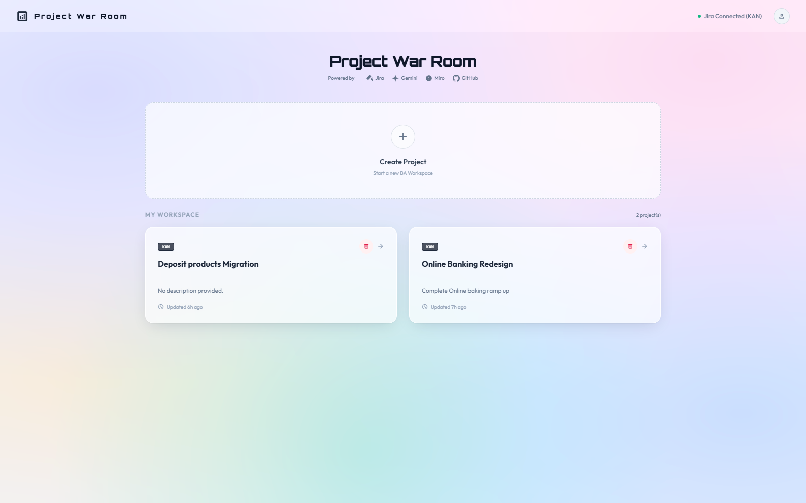
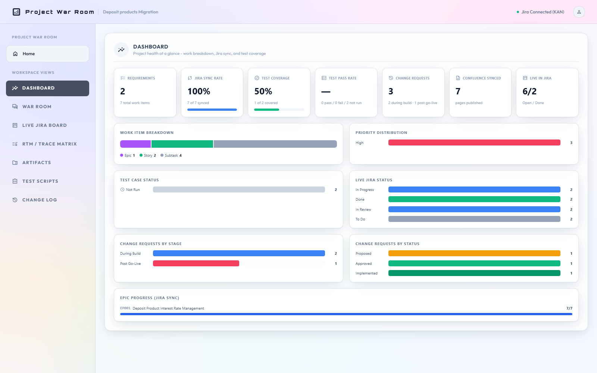
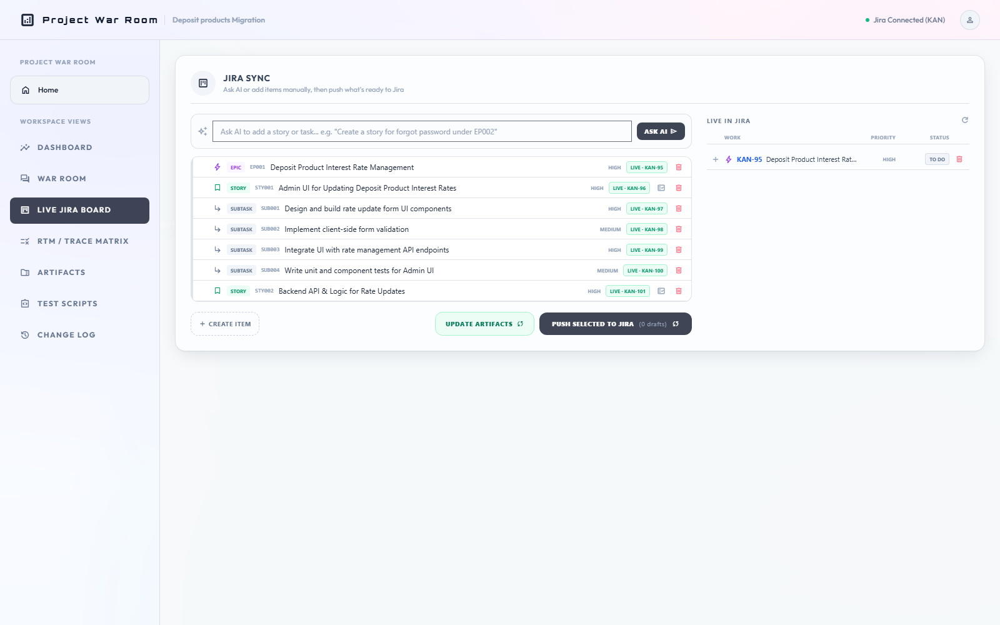
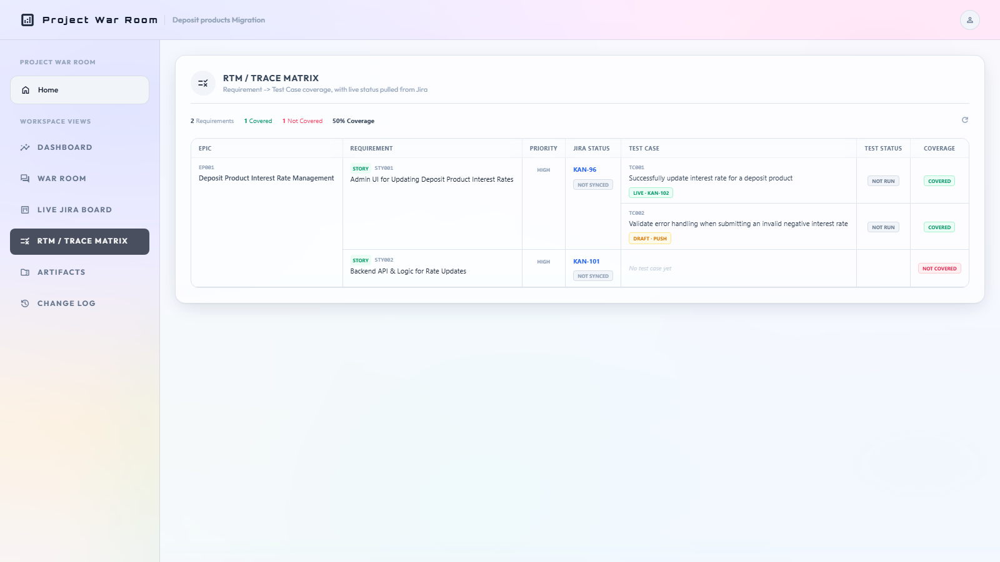

# Project War Room

An AI-powered Business Analyst & Project Management workspace. Describe a requirement in plain English and Project War Room carries it through the rest of the delivery lifecycle: requirements documentation, a Jira work breakdown, traceable test coverage, change management, and stakeholder-ready reporting — grounded in BABOK v3 technique references throughout.

It's built for BA/PM-style workflows on real projects (the included sample projects are retail banking scenarios — deposit product rate management, teller account opening, an online banking redesign), not a generic code generator.

## Screenshots

| | |
|---|---|
|  |  |
|  |  |

## What it does

- **War Room chat** — describe a requirement to an AI Business Analyst; it asks clarifying questions and drives what gets generated next.
- **Document generation** — Business Requirements Document, Functional Requirements Spec, Use Case Specification, Process Flow diagram, System Architecture spec, and a User Story Map & Sprint Backlog, all authored from the conversation plus anything pinned in the project's Knowledge Base.
- **Jira Sync** — draft an Epic → Story/Task → Subtask hierarchy locally, then push it to a real Jira Cloud/Data Center project. Pushing is hierarchy-aware (parents resolved automatically) and every item's Draft/Live state is tracked.
- **RTM / Trace Matrix** — generate AI-authored, Jira-traceable test cases per Story/Task, push them individually to Jira as linked Subtasks, and track requirement coverage and pass/fail status live.
- **Change Log** — a Change Request Register for scope changes, distinguishing changes raised during the build from post-go-live amendments, each optionally linked back to the requirement it affects.
- **Dashboard** — live KPIs (requirements, Jira sync rate, test coverage, test pass rate, change requests, Confluence pages published, live Jira status) plus breakdown charts.
- **Confluence integration** — publish any generated document to Confluence, or sync a live report (Jira tasks, RTM, Change Log) as a Confluence page that's updated in place on every re-sync instead of duplicating.
- **Miro integration** — auto-generated swimlane process-flow and layered system-architecture diagrams, kept live in Miro (not static images).
- **Knowledge Base** — pin reference documents (uploaded files or pasted notes) that ground every AI generation call for a project.
- **Reporting** — one-click CSV export of live Jira tasks, the RTM, and the Change Log.

## Tech stack

- **Backend**: FastAPI (Python), SQLite for persistence
- **AI**: OpenAI (model configurable via `OPENAI_MODEL`)
- **Frontend**: a single-page vanilla JS + Tailwind CSS app — no build step, no framework
- **Integrations**: Jira Cloud/Data Center REST API, Confluence REST API, Miro REST API

## Getting started

### Prerequisites

- Python 3.10+
- An OpenAI API key
- Optional, to use the integrations: Jira Cloud/Data Center credentials, a Miro access token

### Installation

```bash
git clone https://github.com/Prady089/Project_War_Room.git
cd Project_War_Room
pip install -r requirements.txt
cp .env.example .env   # then fill in your real values
python server.py
```

Open **http://localhost:8003**.

### Environment variables

See [`.env.example`](.env.example) for the full, commented list. In short:

| Variable | Required | Purpose |
|---|---|---|
| `OPENAI_API_KEY`, `OPENAI_MODEL` | Yes | Powers all document/test-case generation |
| `JIRA_URL`, `JIRA_USERNAME`, `JIRA_API_TOKEN`, `JIRA_PROJECT_KEY` | For Jira/Confluence features | Jira Cloud credentials (use `JIRA_PERSONAL_TOKEN` instead of username/token for Data Center/Server) |
| `MIRO_ACCESS_TOKEN` | For Miro diagrams | Miro app access token |
| `DATA_DIR` | No | Where `nexus.db` and generated files live. Leave unset for local dev; set it to a mounted persistent disk's path when deploying somewhere with an ephemeral filesystem (see below) |

## Deploying

The app is a single long-lived Python process — it runs anywhere that can host that (Render, Railway, a VM, etc.). It persists to a local SQLite file and a local folder of generated documents, so on a host with an **ephemeral filesystem** (e.g. Render without a persistent disk attached), every redeploy or idle spin-down wipes that data. Mount a persistent disk and point `DATA_DIR` at it to avoid that.

## Author

**Pradeep Kumar**
[LinkedIn](https://www.linkedin.com/in/prady089/)
